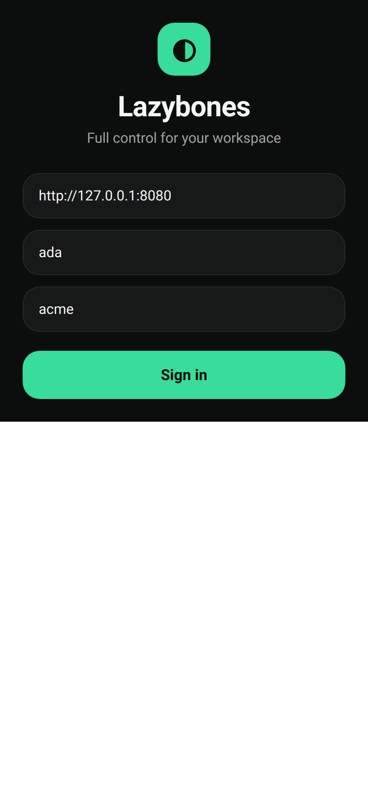
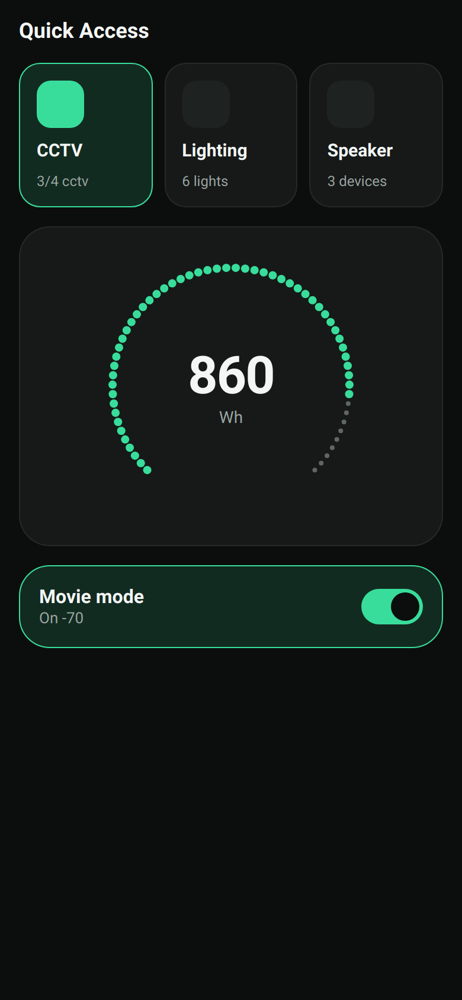

# Session — App design system (Unistyles 3)

Scope: [`docs/scope/app/app-design-system-scope.md`](../../scope/app/app-design-system-scope.md).

## Goal

Give `app/shell` a real, fast design system in the dark + mint smart-home style the user referenced
(Xiaomi / MYGRID dashboards). Chose **react-native-unistyles 3** (C++/Nitro engine — no-re-render
theming, fastest RN styling layer) over NativeWind; own the components (shadcn philosophy).

## What I did

1. Installed (standalone, `pnpm add --ignore-workspace` per the shell's React-18/19 split):
   react-native-unistyles, react-native-nitro-modules, react-native-edge-to-edge, react-native-svg,
   lucide-react-native; devDeps @babel/plugin-syntax-typescript, babel-plugin-syntax-hermes-parser.
2. Wired the Babel transform both sides: native via the official `RepackUnistylePlugin`
   (`rspack.config.mjs`); web preview via a custom `web/unistyles-babel.vite.ts` (RN-Web transpiles
   with esbuild, not Babel, so the plugin needed a Vite home).
3. Theme: `src/theme/tokens.ts` (dark theme, mint accent, 4pt `space()` grid), registered in
   `theme/unistyles.ts` (imported top of `index.js` + `web/index.web.tsx`), typed in
   `theme/theme-augment.d.ts`, nav chrome in `theme/navigation.ts`.
4. UI kit `src/ui/`: Card, Tile, Toggle (Animated spring), GaugeRing (svg dotted ring).
5. Re-skinned LoginScreen + ChannelsScreen onto the kit (logic untouched).

## Bumps (→ debugging entries)

- **Theme resolved to `never`.** Two causes, both logged: (a) the type-augmentation file was named
  `unistyles.d.ts` next to `unistyles.ts`, so tsc treated it as that file's emit output and excluded
  it from the program — renamed to `theme-augment.d.ts`; (b) `UnistylesThemes` is a *module* export,
  so the merge must be `declare module 'react-native-unistyles'`, not a global `interface`. See
  `docs/debugging/app/unistyles-theme-never.md`.
- **Web preview wouldn't boot with react-native-svg.** Its Fabric `*NativeComponent.js` files chain
  into native-only RN modules (`codegenNativeComponent`, `TurboModuleRegistry`) that react-native-web
  doesn't expose; chasing them individually failed. Resolved by aliasing `react-native-svg` to a
  DOM-`<svg>` shim (`web/svg-shim/`) for the preview only. See
  `docs/debugging/app/rn-svg-web-preview.md`.

## Verification

- `pnpm typecheck` → green (exit 0).
- Web preview (`vite.config.web.mts`) screenshotted headless (puppeteer):
  - Login:  — dark canvas, mint brand mark + CTA, raised
    hairline inputs.
  - UI kit gallery (throwaway harness, deleted after):  — active
    mint tile vs inactive, dotted gauge ring (**60 svg circles** drawn through the shim, mint lead
    arc), mint toggle on. Matches the reference look.

Native (`RepackUnistylePlugin`) path is wired + typechecks but not yet visually verified on a device
— tracked in the scope's open questions.
